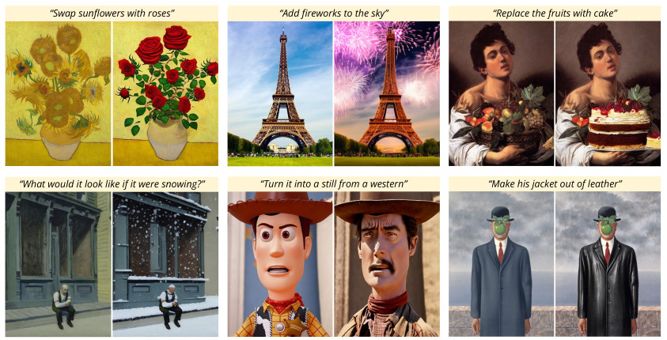
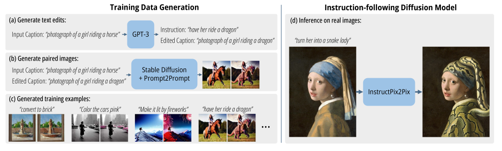
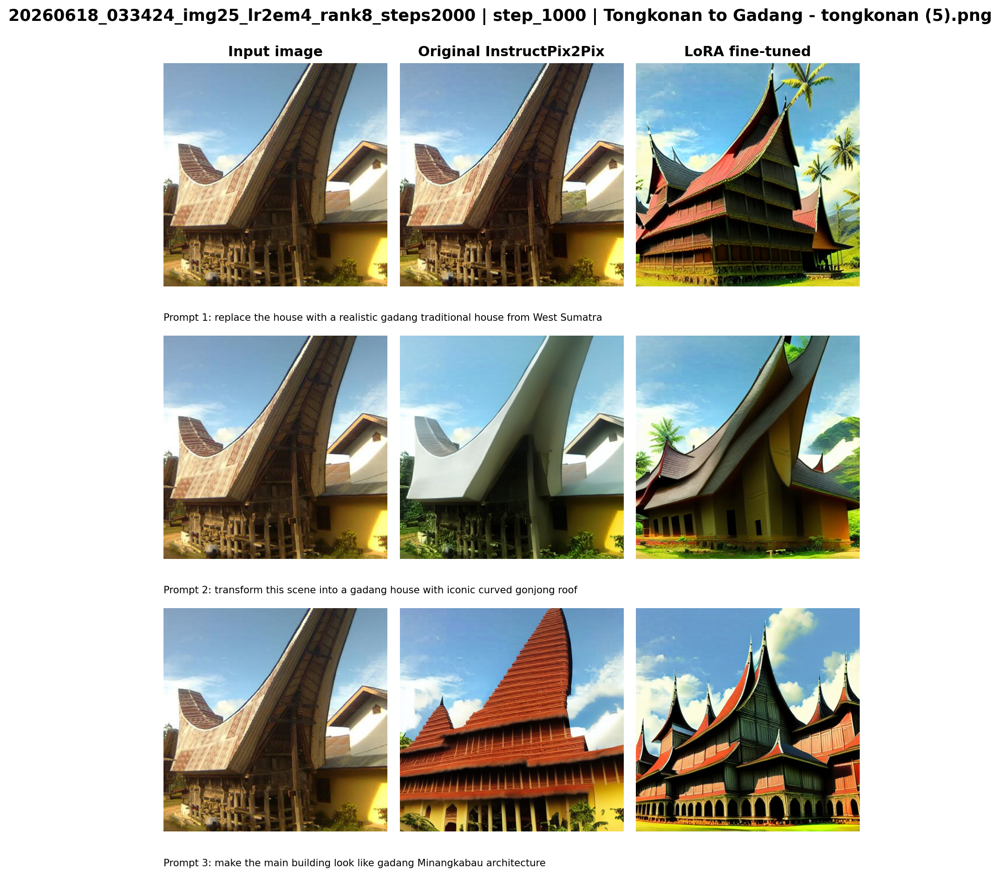
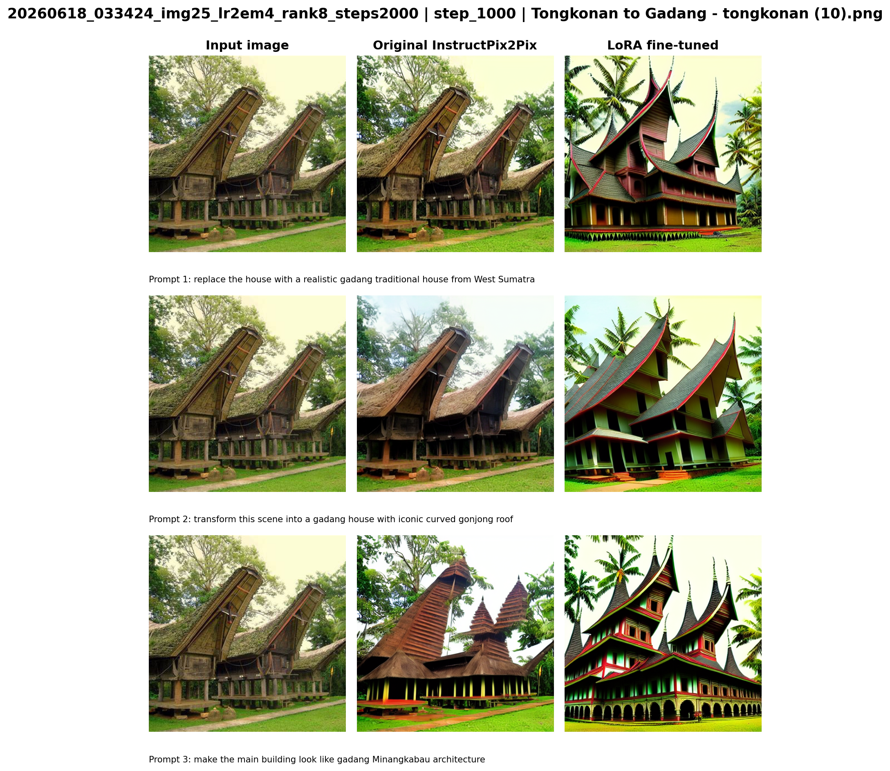
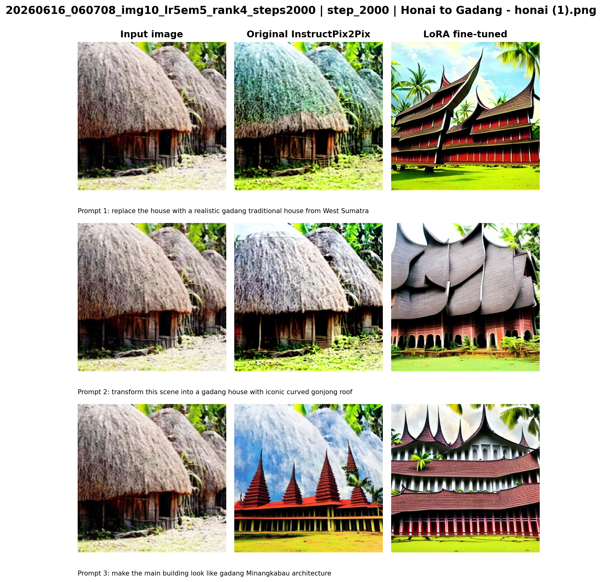
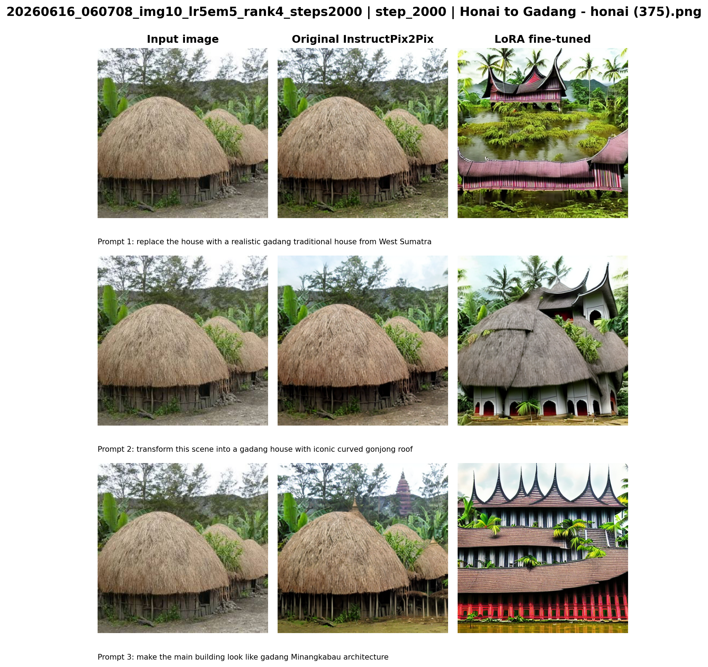

# Gadang LoRA Concept Editing

This project trains a **LoRA concept adapter** for the visual identity of **Rumah Gadang**, the traditional Minangkabau house from West Sumatra. The adapter is trained on **Stable Diffusion 1.5**, then the trained LoRA weights are loaded into the **InstructPix2Pix** editing pipeline for evaluation.

In short:

```text
Rumah Gadang images + caption token "gadang"
        -> LoRA concept training on Stable Diffusion 1.5
        -> LoRA adapter
        -> evaluated inside InstructPix2Pix image editing
```

This is not full InstructPix2Pix fine-tuning. The goal is to teach a reusable visual concept token, `gadang`, and test whether the edit model can use that concept when the prompt asks it to turn another traditional house into a Gadang-style house.

## InstructPix2Pix Reference

InstructPix2Pix is an instruction-following image editing model. Given an input image and a text instruction, it edits the image to follow the instruction.

The examples below are from the original CVPR paper, [InstructPix2Pix: Learning to Follow Image Editing Instructions](https://openaccess.thecvf.com/content/CVPR2023/papers/Brooks_InstructPix2Pix_Learning_To_Follow_Image_Editing_Instructions_CVPR_2023_paper.pdf). A local copy is also available at [pdf/Brooks_InstructPix2Pix_Learning_To_Follow_Image_Editing_Instructions_CVPR_2023_paper.pdf](pdf/Brooks_InstructPix2Pix_Learning_To_Follow_Image_Editing_Instructions_CVPR_2023_paper.pdf).

## Paper Results

The original paper shows that InstructPix2Pix can edit real images from natural-language instructions without per-example inversion or fine-tuning.



## Training in the Paper

The original InstructPix2Pix training process uses paired editing data:

```text
input image + edit instruction -> edited target image
```

The paper generates this training data with text edits and paired images, then trains an instruction-following diffusion model.



## Mathematical Paper Approach

InstructPix2Pix is trained as a conditional latent diffusion model. For a target edited image `x`, the VAE encoder `E` maps the image into a latent representation:

```text
z = E(x)
```

Noise is added at timestep `t` to produce `z_t`. The network then predicts the added noise from three inputs:

```text
z_t  = noisy edited-image latent
c_I  = input image conditioning
c_T  = text edit instruction conditioning
```

The training loss from the paper is the denoising objective:

```text
L = E[ || epsilon - epsilon_theta(z_t, t, E(c_I), c_T) ||_2^2 ]
```

where `epsilon` is sampled Gaussian noise and `epsilon_theta` is the model prediction. Intuitively, the model learns to remove noise from the target edited image latent while being guided by both the original image and the edit instruction.

The paper also uses classifier-free guidance with two conditioning sources. A simplified single-conditioning form is:

```text
e_tilde_theta(z_t, c)
  = e_theta(z_t, empty)
    + s * (e_theta(z_t, c) - e_theta(z_t, empty))
```

For InstructPix2Pix, there are two guidance scales:

```text
s_I = image guidance scale
s_T = text guidance scale
```

The paper's two-conditioning guidance can be written as:

```text
e_tilde_theta(z_t, c_I, c_T)
  = e_theta(z_t, empty, empty)
    + s_I * (e_theta(z_t, c_I, empty) - e_theta(z_t, empty, empty))
    + s_T * (e_theta(z_t, c_I, c_T) - e_theta(z_t, c_I, empty))
```

In simple terms, `s_I` controls how much the output preserves the input image structure, while `s_T` controls how strongly the edit instruction is applied.

## Concept Fine-Tuning in This Project

This repository does not mainly follow the full paired-image fine-tuning setup from the paper. Instead, it uses a lighter concept-learning setup:

```text
real Rumah Gadang images + captions containing "gadang"
        -> train LoRA concept adapter on Stable Diffusion 1.5
        -> load the LoRA adapter into InstructPix2Pix for editing evaluation
```

So the model is not trained with paired edit examples such as `before image -> after image`. Instead, it learns the visual meaning of the token `gadang`, then that token is used inside editing prompts.

The experiment trains **27 LoRA concept schemes**:

```text
3 image counts    x  3 learning rates      x  3 LoRA ranks
10, 25, 50        x  5e-5, 1e-4, 2e-4      x  4, 8, 16
= 27 trained LoRA adapters
```

This grid is used to observe how dataset size, learning rate, and LoRA rank affect the ability to learn the Gadang visual concept.

LoRA concept training teaches a model that a special word or phrase corresponds to a visual concept. In this project, the important token is:

```text
gadang
```

Training captions repeatedly connect this token to real Rumah Gadang images, for example:

```text
a photo of gadang
traditional Minangkabau gadang house
wooden gadang house with curved roof
```

Compared with ordinary LoRA fine-tuning, this setup is concept-centered:

- **LoRA concept training**: learns a visual identity behind a token such as `gadang`.
- **Ordinary LoRA fine-tuning**: may adapt style, domain, or task behavior more broadly.
- **Full fine-tuning**: updates many more model weights and is heavier to train and store.

This repository only keeps LoRA concept training instructions in this README. DreamBooth notes are moved to [DREAMBOOTH.md](DREAMBOOTH.md).

## Fine-Tuning Results

### Success Case: Tongkonan

Tongkonan houses already have a strong roof silhouette, so the model often adapts them better into the Gadang visual identity.





### Failure Case: Honai

Honai houses are much more difficult for this pipeline. Their round, compact structure is significantly different from Rumah Gadang's elongated body and curved roof. Because of that, InstructPix2Pix often cannot inpaint the requested Gadang structure cleanly from a Honai input.





## Technical Setup and Training Process

### References

- InstructPix2Pix official GitHub: https://github.com/timothybrooks/instruct-pix2pix
- InstructPix2Pix CVPR 2023 paper: https://openaccess.thecvf.com/content/CVPR2023/papers/Brooks_InstructPix2Pix_Learning_To_Follow_Image_Editing_Instructions_CVPR_2023_paper.pdf
- Local InstructPix2Pix PDF: [pdf/Brooks_InstructPix2Pix_Learning_To_Follow_Image_Editing_Instructions_CVPR_2023_paper.pdf](pdf/Brooks_InstructPix2Pix_Learning_To_Follow_Image_Editing_Instructions_CVPR_2023_paper.pdf)
- InstructPix2Pix Hugging Face model: https://huggingface.co/timbrooks/instruct-pix2pix
- Hugging Face Diffusers InstructPix2Pix pipeline docs: https://huggingface.co/docs/diffusers/en/api/pipelines/pix2pix
- Hugging Face Diffusers LoRA training docs: https://huggingface.co/docs/diffusers/en/training/lora
- Diffusers LoRA training script: https://github.com/huggingface/diffusers/blob/main/examples/text_to_image/train_text_to_image_lora.py
- Stable Diffusion 1.5 Hugging Face model: https://huggingface.co/stable-diffusion-v1-5/stable-diffusion-v1-5

### Project Layout

```text
notebook/
  lora_concept_grid.ipynb
  evaluation_grid_summary/gadang_eval_grid_summary.ipynb

scripts/
  run_gadang_lora_grid.sh
  audit_gadang_lora_progress.py
  generate_gadang_eval_grids.py
  run_gadang_eval_grid_summary.sh

traditional_houses/
  gadang/
  joglo/
  honai/
  panjang/
  tongkonan/

outputs/
  yyyymmdd_hhmmss_img10_lr1em4_rank8_steps2000/
    concept_dataset/
    checkpoints/
    evaluation/
    metrics/
    logs/
    notebook/

results/
  gadang_evaluation_grids/
  gadang_lora_progress/
```

`outputs/` is intentionally ignored by Git because it contains heavy run artifacts. Curated figures and summaries are stored in `results/`.

### Setup

Install dependencies:

```bash
uv sync
```

Prepare local checkpoints:

```text
models/v1-5-pruned-emaonly.ckpt
models/instruct-pix2pix-00-22000.ckpt
```

The LoRA training notebook loads Stable Diffusion 1.5 from:

```text
models/v1-5-pruned-emaonly.ckpt
```

The evaluation pipeline loads InstructPix2Pix from:

```text
models/instruct-pix2pix-00-22000.ckpt
```

### Dataset

Place real Rumah Gadang images here:

```text
traditional_houses/gadang/
```

Place comparison/evaluation images here:

```text
traditional_houses/joglo/
traditional_houses/honai/
traditional_houses/panjang/
traditional_houses/tongkonan/
```

The pipeline uses deterministic train, validation, and test splits. For Tongkonan evaluation, it prioritizes:

```text
traditional_houses/tongkonan/tongkonan (5).png
```

The file `tongkonan (1).png` is excluded from evaluation.

### Smoke Test

Run a tiny LoRA job to check training, checkpointing, logging, and evaluation:

```bash
IMAGE_COUNTS="10" LEARNING_RATES="1e-4" LORA_RANKS="8" \
MAX_TRAIN_STEPS=1 CHECKPOINT_EVERY=1 \
RUN_EVALUATION=1 RUN_METRICS=0 \
EVAL_IMAGES_PER_CLASS=1 EVAL_PROMPT_COUNT=2 EVAL_NUM_INFERENCE_STEPS=5 \
scripts/run_gadang_lora_grid.sh
```

Watch the root log:

```bash
tail -f output.log
```

### Full LoRA Grid

Default grid:

```text
IMAGE_COUNTS="10 25 50"
LEARNING_RATES="5e-5 1e-4 2e-4"
LORA_RANKS="4 8 16"
MAX_TRAIN_STEPS=2000
CHECKPOINT_EVERY=200
```

Run the full grid:

```bash
nohup scripts/run_gadang_lora_grid.sh >/dev/null 2>&1 &
```

The runner skips completed runs and resumes partial runs from the latest saved LoRA checkpoint when possible.

### Runtime Options

Common options:

```bash
IMAGE_COUNTS="10 25 50"
LEARNING_RATES="5e-5 1e-4 2e-4"
LORA_RANKS="4 8 16"
STABLE_DIFFUSION_CKPT="models/v1-5-pruned-emaonly.ckpt"
INSTRUCT_PIX2PIX_CKPT="models/instruct-pix2pix-00-22000.ckpt"
MAX_TRAIN_STEPS=2000
CHECKPOINT_EVERY=200
GRADIENT_ACCUMULATION_STEPS=4
TRAIN_BATCH_SIZE=1
RUN_EVALUATION=1
RUN_METRICS=1
EVAL_IMAGES_PER_CLASS=2
EVAL_PROMPT_COUNT=3
EVAL_NUM_INFERENCE_STEPS=30
SKIP_EXISTING=1
ROOT_LOG=output.log
```

Example custom run:

```bash
IMAGE_COUNTS="25" LEARNING_RATES="1e-4" LORA_RANKS="16" \
MAX_TRAIN_STEPS=2000 CHECKPOINT_EVERY=200 \
scripts/run_gadang_lora_grid.sh
```

### Checkpoints

Training is controlled by optimizer steps, not epochs.

LoRA checkpoints are saved every `CHECKPOINT_EVERY` steps:

```text
outputs/<run_name>/checkpoints/step_0200/lora_adapter/
outputs/<run_name>/checkpoints/step_0400/lora_adapter/
...
outputs/<run_name>/checkpoints/step_2000/lora_adapter/
outputs/<run_name>/checkpoints/final/lora_adapter/
```

The final adapter is also copied to:

```text
outputs/<run_name>/checkpoints/lora_adapter/
```

Checkpoint metadata:

```text
outputs/<run_name>/checkpoints/checkpoints_manifest.json
```

### Evaluation

Evaluation loads the base InstructPix2Pix checkpoint and attaches the trained LoRA adapter to its UNet.

For each saved checkpoint, the notebook creates:

```text
outputs/<run_name>/evaluation/checkpoints/<checkpoint_label>/generated_images/
outputs/<run_name>/evaluation/checkpoints/<checkpoint_label>/grids/
outputs/<run_name>/evaluation/eval_manifest.json
outputs/<run_name>/evaluation/evaluation_records.json
```

Each per-checkpoint grid uses:

```text
input | original InstructPix2Pix | LoRA fine-tuned output
```

### Result Grids

After several runs finish, generate summary grids across all checkpoints and schemes:

```bash
scripts/run_gadang_eval_grid_summary.sh
```

Output:

```text
results/gadang_evaluation_grids/img10/
results/gadang_evaluation_grids/img25/
results/gadang_evaluation_grids/img50/
results/gadang_evaluation_grids/grid_manifest.csv
```

The summary grid format is:

```text
Input | Original Instruct | step 0200 | step 0400 | ... | step 2000
```

Rows are grouped by LoRA scheme and prompt.

### Metrics

When `RUN_METRICS=1`, the notebook computes:

- FID against held-out real Gadang reference images
- CLIP text-image similarity if the local CLIP model can be loaded
- simple image diversity score

Important LoRA metric fields:

```text
fid_original_vs_real_gadang
fid_fine_tuned_vs_real_gadang
clip_text_image_original_mean
clip_text_image_fine_tuned_mean
```

Lower FID is better. Higher CLIP text-image similarity is better.

## Conclusion

This project shows that LoRA concept training can introduce the visual identity of Rumah Gadang into an editing workflow without fully fine-tuning InstructPix2Pix. By training a small adapter on Stable Diffusion 1.5 and evaluating it inside InstructPix2Pix, the pipeline can test whether the token `gadang` becomes useful for image editing prompts.

The qualitative results suggest that the method works better when the input house already has a related architectural structure. Tongkonan is a stronger success case because its roof silhouette is closer to the curved, expressive roof shape of Rumah Gadang. Honai is a common failure case because its compact round form is structurally very different, so the edit model often cannot transform it into a clean Gadang-style building.

Overall, LoRA concept training is a lightweight and practical approach for learning a cultural architectural identity from a limited dataset. However, for large structural edits, paired image-edit training or stronger inpainting supervision may still be needed.
